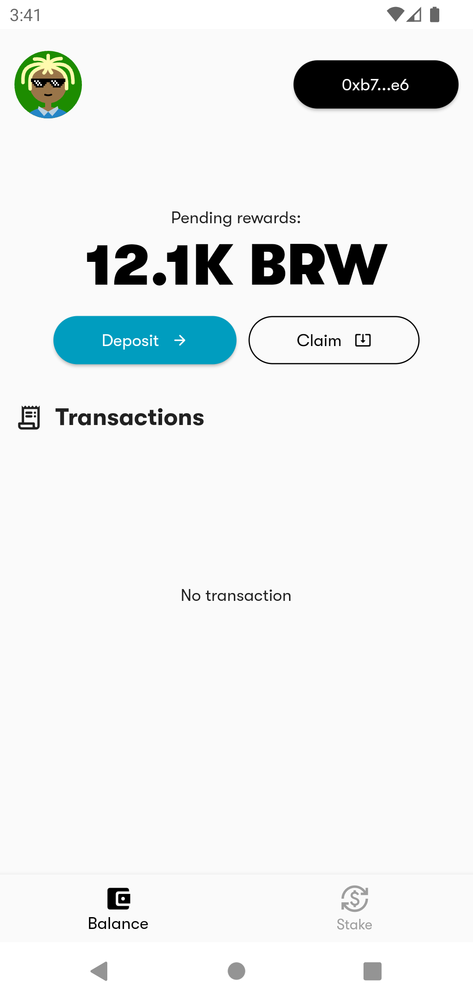
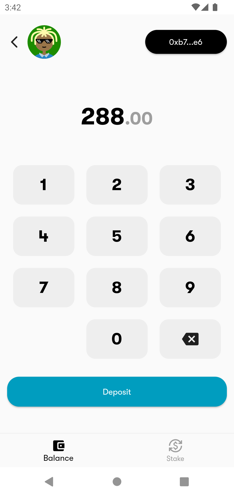
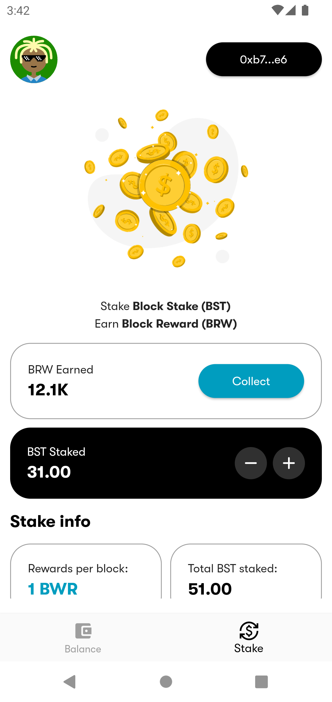
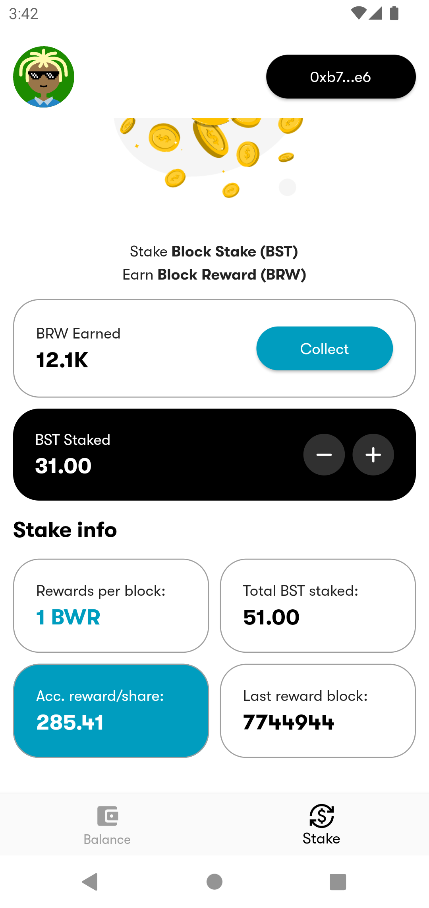

<div align="center">
  <h2 align="center">Block Stake UI</h2>

  <p align="center">
    Block Stake are a set of contracts that facilitate staking following the MasterChef staking algorithm.
    <br />
    <br />
    <a href="#" target="_blank" rel="noopener noreferrer">View Demo</a>
  </p>
</div>

## About

Block Stake UI serves as a frontend dApp for <a href="https://github.com/kingahmedino/block-stake.git" target="_blank" rel="noopener noreferrer">Block Stake</a> which is a staking contract following a modified version of Sushiswap's MasterChef algorithm.

The dApp helps users to manage their stake and reward assets and every other information about the current staking process. The dApp uses <a href="https://metamask.io/" target="_blank" rel="noopener noreferrer">Metamask</a> as wallet provider while using <a href="https://walletconnect.com/" target="_blank" rel="noopener noreferrer">Wallet Connect</a> and <a href="https://pub.dev/packages/web3dart" target="_blank" rel="noopener noreferrer">web3dart</a> to interface between the blockchain and Metamask.

   

## Getting Started

1. Clone the repo
   ```sh
   git clone https://github.com/kingahmedino/block-stake-ui.git && cd block-stake-ui
   ```
2. Run `flutter pub get` to get all dependencies
3. Run `flutter run` to run the app

A few resources to get you started if this is your first Flutter project:

- [Lab: Write your first Flutter app](https://docs.flutter.dev/get-started/codelab)
- [Cookbook: Useful Flutter samples](https://docs.flutter.dev/cookbook)

For help getting started with Flutter development, view the
[online documentation](https://docs.flutter.dev/), which offers tutorials,
samples, guidance on mobile development, and a full API reference if you face issues with your set up.

## Contributing

Contributions are what make the open source community such an amazing place to learn, inspire, and create. Any contributions you make are **greatly appreciated**.

If you have a suggestion that would make this better, please fork the repo and create a pull request. You can also simply open an issue with the tag "enhancement".
Don't forget to give the project a star! Thanks again!

1. Fork the Project
2. Create your Feature Branch (`git checkout -b feature/AmazingFeature`)
3. Commit your Changes (`git commit -m 'Add some AmazingFeature'`)
4. Push to the Branch (`git push origin feature/AmazingFeature`)
5. Open a Pull Request
